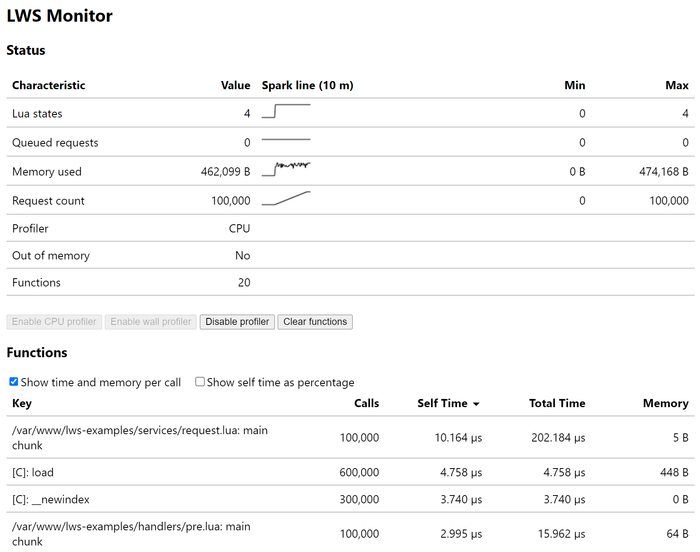

# LWS Monitor

The LWS monitor is a web API that provides read-write access to central LWS characteristics. It
is configured through the `lws_monitor` [directive](Directives.md).

> [!WARNING]
> The LWS monitor should *not* be enabled at locations that are publicly accessible. Enabling
> the monitor at a location without appropriate access controls is a security risk.


## `GET` Method

The `GET` method returns a JSON document as follows:

```json
{
	"states_n": 0,
	"requests_n": 0,
	"memory_used": 0,
	"request_count": 0,
	"out_of_memory": 0,
	"profiler": 0,
	"functions": [
		["/var/www/lws-examples/services/request.lua:2: render_var", 282, 0, 774532, 0, 4464414, 15980],
		["/var/www/lws-examples/services/request.lua: main chunk", 47, 0, 1186461, 0, 11546675, 1880]
	]
}
```

The following table describes the keys of the document.

| Key | Type | Description |
| --- | --- | --- |
| `states_n` | `number` | Number of Lua states (active + inactive) |
| `requests_n` | `number` | Number of queued requests |
| `memory_used` | `number` | Memory used by Lua states, in bytes |
| `request_count` | `number` | Total number of requests served |
| `out_of_memory` | `number` | Monitor has run out of memory; `0` = no, `1` = yes |
| `profiler` | `number` | Profiler state; `0` = disabled, `1` = CPU, `2` = wall |
| `functions` | `array` | Profiled functions (see below) |

> [!NOTE]
> The term *memory* in the context of LWS and Lua states generally refers to the memory allocated
> by the Lua states per se, i.e., through their memory allocators. This memory does *not* include
> memory allocated outside of Lua states, such as in Lua C libraries or NGINX.


### Profiled Function

An array with the following values represents each profiled function.

| Index | Type | Description |
| --- | --- | --- |
| 0 | `string` | Function key |
| 1 | `number` | Number of calls |
| 2 | `number` | Self-time, seconds |
| 3 | `number` | Self-time, nanoseconds |
| 4 | `number` | Total time, seconds |
| 5 | `number` | Total time, nanoseconds |
| 6 | `number` | Allocated memory, in bytes |

> [!NOTE]
> Please take note of the following definitions and limitations as regards the LWS profiler.

The profiler uses the fixed-size shared memory zone of the LWS monitor (currently 512 KB). If the
zone runs out of memory, an error is logged, and the `out_of_memory` flag is set. In this case,
the list of profiled functions is incomplete.

Lua functions are first-class values without a fixed name. The profiler identifies each function
through a key, which is a string. This may sometimes result in distinct functions being folded
into the same key, such as `[C]: ?`, or the same function being aliased through multiple keys.

Self-time and total time are measured in thread CPU time or wall time, depending on the
`profiler` value. Each time is represented with a second and a nanosecond component. Due to
profiler overhead, all time values are approximations.

Self-time is the time spent in the function per se. In contrast, total time additionally includes
the time spent in child functions, i.e., functions directly or indirectly called from the function
under consideration.

A proper tail call is processed as an exit from the calling function and thus does not accumulate
child time for the calling function (unless the calling function is already active further down in
the call stack, which implies that it did not perform a proper tail call at that stack location.)

Allocated memory is the amount of Lua memory allocated during the execution of the function per
se. Due to potential garbage collection and profiler overhead, this is an approximation.


### Response Status

The response has a 200 OK status.


## `POST` Method

The `POST` method modifies the state of the LWS monitor. The content type of the request body
must be `application/x-www-form-urlencoded`. The following table describes the keys that can be
modified.

| Key | Description |
| --- | --- |
| `profiler` | Profiler state; `0` = disabled, `1` = CPU, `2` = wall |
| `functions` | Profiled functions; `[]` to clear |

For the `profiler` key, valid transitions are from the disabled state to one of the enabled
states and vice versa; transitions from one enabled state to another are invalid.

Clearing the profiled functions also clears the `out_of_memory` flag.


### Response Status

The response has a 200 OK status if the modification succeeded, a 400 Bad Request status if an
invalid value was provided, or a 409 Conflict status if the modification failed. The latter can
happen due to a concurrent modification or an invalid transition.


## Examples Website

The [examples website](GettingStarted.md) includes a self-contained web page that displays
periodically updated data from the LWS monitor and allows for controlling the profiler. The page
looks similar to the following figure.


